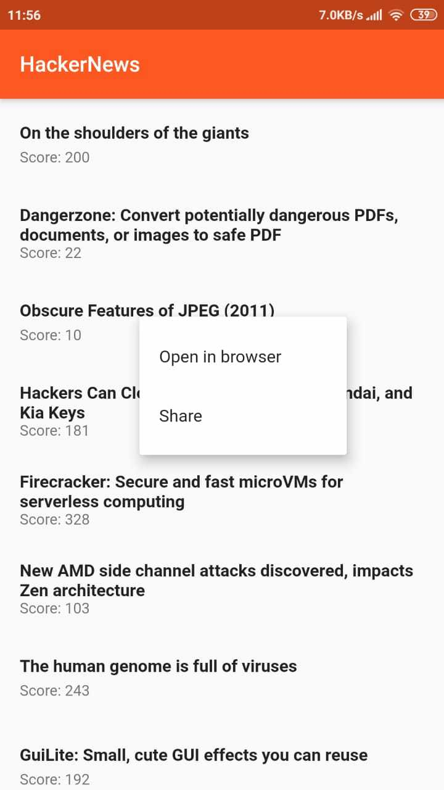

# Simple HackerNews App Using Flutter

  

Try the APK from here: https://github.com/sreejithbnaick/flutter-hackernews/releases

Sor far this app can do:

1. List 25 top stories from HackerNews.
2. Open the Story url in a webview.
3. Long press on List Item
    + To open the story url in a Browser.
    + To share the story url.
4. From Webview screen do the following:
    + Edge swipe from Left to Go Backwards.
    + Edge swipe from right to Go Forwards.
    + Backpress will exit the Webview screen to top stories list.
    + Using menu in action bar: 
        + Open the current link a browser.
        + Share the current link.

### TODO:

1. PDF links does not work. Need to add support for PDF.
2. HN discussion link does not open. Need to fix it.
3. Error State Handling: Refresh Page, Refresh Item, Retry, Offline support.
3. Add test :P